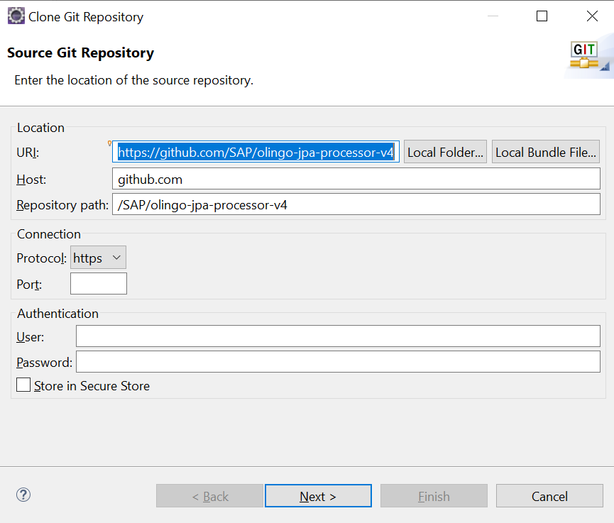
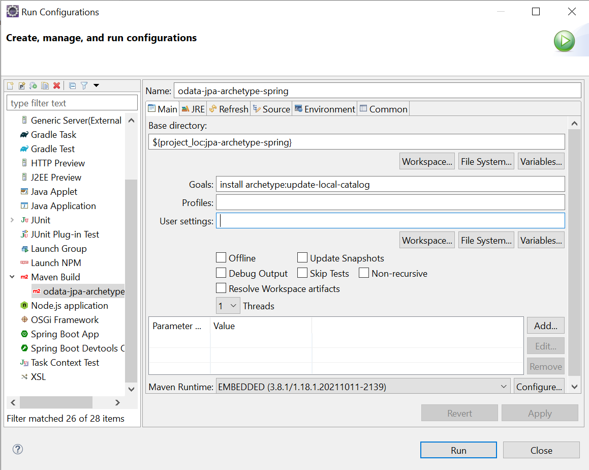
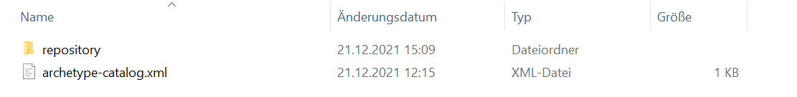
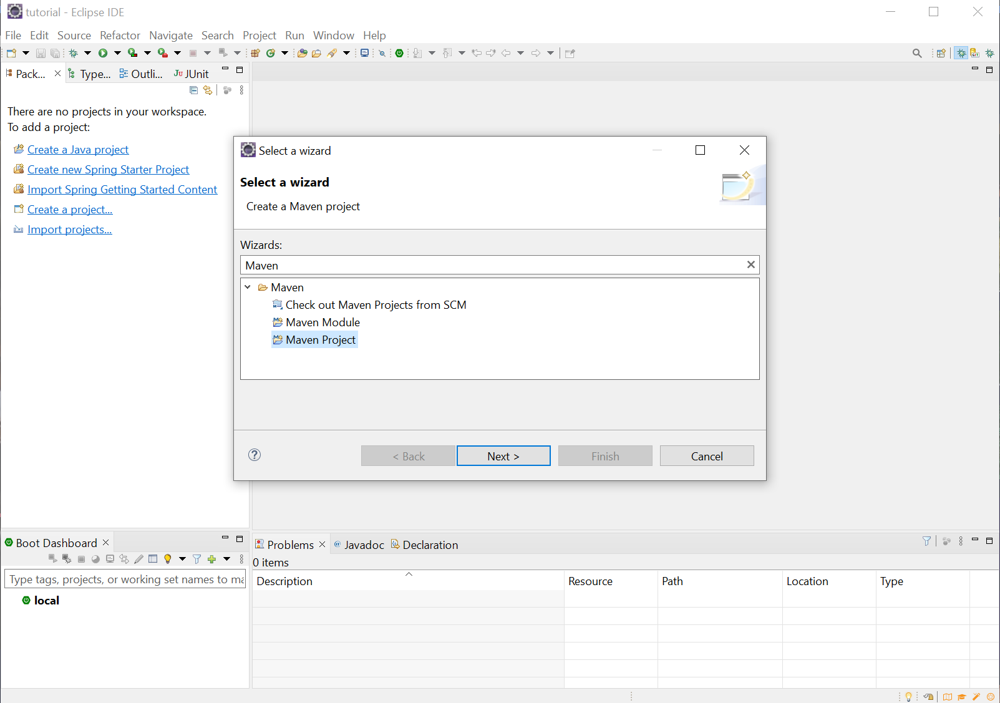
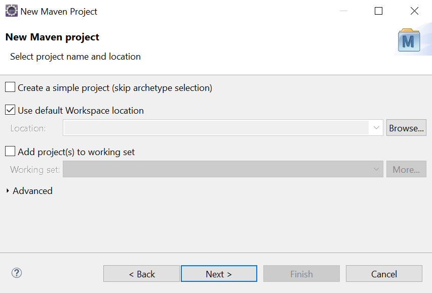
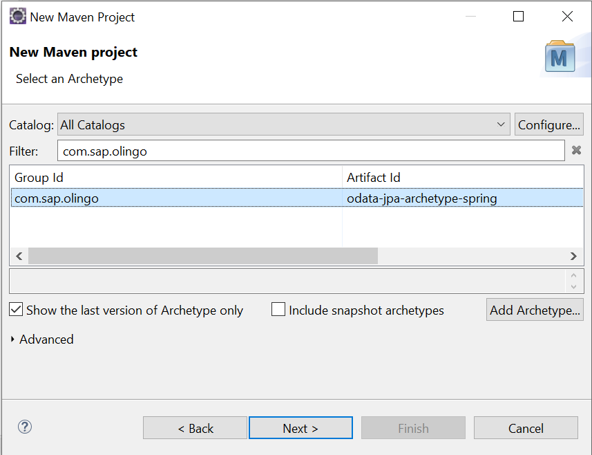
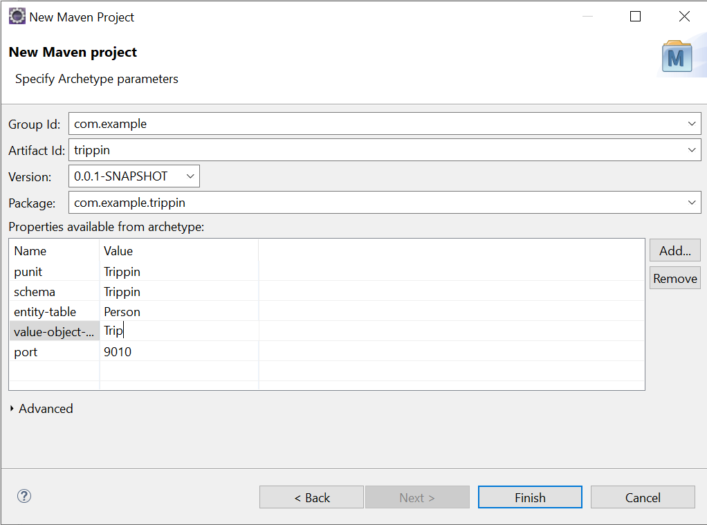
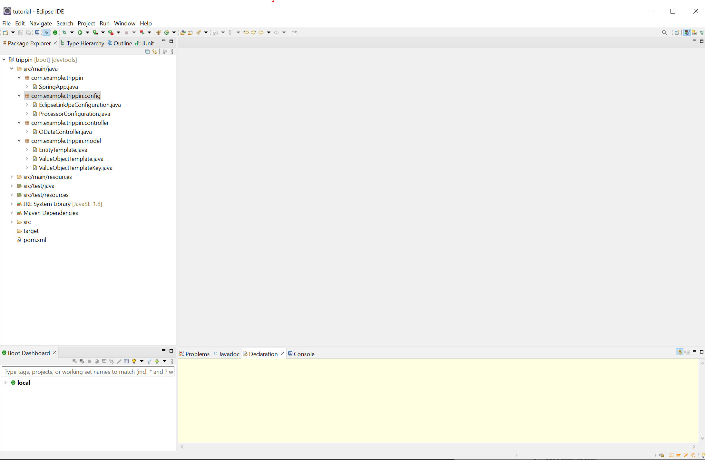

= Quick Start

This tutorial shall provide a first step to create an OData V4 service based on JPA metadata. It builds the foundation for the upcoming once.

Eclipse is used as IDE, but another IDE could be used as well. The IDE should contain Spring support like the Eclipse Plug-in *Spring Tools 4*.

== Prerequisites

In order to follow this tutorial, you should have

* Basic knowledge about OData and OData V4
* Knowledge of the Java programming language
* Basic knowledge about building with Maven
* Optional: knowledge about Spring

== Preparation

In order to perform the tutorial you need:

* A Java JDK 17 or higher
* A Eclipse IDE for Java EE, or another one that provides the same functionality
* Optional: Maven separately installed, to perform  Maven commands in case the JPA Processor projects should not be imported into your IDE
* Optional: Git separately installed.

== Preparing the Archetype

We start by cloning the repository. This can be done either via `git clone https://github.com/SAP/olingo-jpa-processor-v4` or by using your IDE:

Open a shell, like the Windows console, navigate to the directory the repository had been cloned to and then to `odata-jpa-archetype-spring`. Starting from the home directory this could be e.g. `cd git\olingo-jpa-processor-v4\jpa-archetype\odata-jpa-archetype-spring`. We do that to generate the archetype. This is done by execute `mvn clean install archetype:update-local-catalog`. Alternatively you can also use your IDE:

In your .m2 directory there should be a file called `archetype-catalog.xml`:

This should contain the information about archetype:

[source,xml]
----
<archetype-catalog xmlns="http://maven.apache.org/plugins/maven-archetype-plugin/archetype-catalog/1.0.0" xmlns:xsi="http://www.w3.org/2001/XMLSchema-instance"
  xsi:schemaLocation="http://maven.apache.org/plugins/maven-archetype-plugin/archetype-catalog/1.0.0 http://maven.apache.org/xsd/archetype-catalog-1.0.0.xsd">
  <archetypes>
    <archetype>
        <groupId>com.sap.olingo</groupId>
        <artifactId>odata-jpa-archetype-spring</artifactId>
        <version>2.0.0</version>
    </archetype>
  </archetypes>
</archetype-catalog>
----

== Creating a Project

Now that we have generated the archetype, we can create a maven project. In Eclipse we can do so by performing the following steps. Choose _File -> New -> Others_ and select _Maven Project_:

Then we have to choose the workspace. Choose _Use default Workspace location_:

Next choose the archetype _odata-jpa-archetype-spring_. You can use _com.sap.olingo_ as filter:

As a last step some parameter have to be provided:

[options="header"]
|===
|Parameter Name   |Value 
//-------------
|Group Id|com.example
|Artifact Id|trippin
|punit|Trippin
|schema|Trippin
|entity-table|Person
|value-object-table|Trip
|===

After _Finish_ was pressed a project gets created:

== Test the Service

. The project contains already some integration tests, which we can execute. The test base on [REST Assured](https://github.com/rest-assured/). They are located under `src/test/java` in package `com.exmple.trippin.integrationtest`. Right click on the project: _Run As -> JUnit Test_.
. The service can be started. Right click on the project: _Run As -> Spring Boot App_. In the favoured browser you should be able to execute e.g. one of the following requests:

   * http://localhost:9010/Trippin/v1/
   * http://localhost:9010/Trippin/v1/$metadata
   * http://localhost:9010/Trippin/v1/Persons

. We can create entities either using `curl` command or a rest tool like https://jmeter.apache.org[Apache JMeter™], https://www.postman.com[Postman] or a browser plugin.
   * Curl:

     curl -X POST http://localhost:9010/Trippin/v1/Persons -H "Content-Type:application/json" -d "{\"Data\" : \"Hallo Welt\"}"
   
   * Rest tool:

     URL: http://localhost:9010/Trippin/v1/Persons
     
     Header: Content-Type:application/json

     { "Data " :  "Hallo Welt "}
 

The result can be checked the by executing  http://localhost:9010/Trippin/v1/Persons?$format=json

== Explanation

=== Dependencies

Looking at the `pom.xml` file we see that the latest version (which is available when the tutorial was written) of 
https://github.com/h2database/h2database[H2 Database] shall be used, which requires a later version of 
https://github.com/flyway/flyway[Flyway] as well.

To use the JPA Processor the following dependency is all that is required:

[source,xml]
----
  <dependency>
      <groupId>com.sap.olingo</groupId>
      <artifactId>odata-jpa-processor</artifactId>
      <version>${processor.version}</version>
  </dependency>
----

* _odata-jpa-processor_ comes with a dependency to _odata-jpa-metadata_. The later one is responsible to convert the JPA annotations into OData metadata. The first one provides the necessary code to handle data requests like queries or changes. _odata-jpa-metadata_ can be used stand alone, if the request handling should be done differently.

The other JPA Processor dependencies are **optional**:

* _odata-jpa-spring-support_ contains a small set of parameter to be used in the Spring `application.yml`.
* _odata-jpa-processor-cb_ contains an enhancement of JPAs Criteria Builder interface, which allows the JPA Processor to use window function ROW_NUMBER and LIMIT/OFFSET in sub queries. Two things have to be pointed out:
  . This part is still in a beta state.
  . Not all databases support ROW_NUMBER with OVER (PARTITION BY ...)

=== Configuration

JPA Processor need to be customized to work properly. Package `com.example.trippin.config` contains two classes that provide this information. The first is `EclipseLinkJpaConfiguration`, 
which is needed to make use of http://www.eclipse.org/eclipselink/[Eclipselink]. For our service the most important part is in method `entityManagerFactory`. Here we provide with `.packages(EntityTemplate.class)` a reference to a package that contains the JPA entities and so defines our persistence-unit.

The second one is `ProcessorConfiguration`. It has two methods. The first one creates a service context, which should be valid for the live time of the service:

[source,java]
----
@Bean
public JPAODataSessionContextAccess sessionContext(@Autowired final EntityManagerFactory emf) 
  throws ODataException {
  
  return JPAODataServiceContext.with()
      .setPUnit(punit) //<1>
      .setEntityManagerFactory(emf)
      .setTypePackage(rootPackages) //<2>
      .setRequestMappingPath("Trippin/v1") //<3>
      .build();
}
----

<1> With _punit_, the persistence-unit name, we define the _Namespace_ of the service. 

<2> The same source has the name of the _rootPackage_, which is needed once we want to build Java based Functions and Actions. 

<3> The _RequestMappingPath_ is needed by Olingo in case a service uses Spring.

[NOTE]
====
The namepsace can be found in the metadata, after executing http://localhost:9010/Trippin/v1/$metadata:
[source,xml]
----
<edmx:Edmx xmlns:edmx="http://docs.oasis-open.org/odata/ns/edmx" Version="4.0">
  <edmx:DataServices>
    <Schema xmlns="http://docs.oasis-open.org/odata/ns/edm" Namespace="Trippin">
      ...
    <Schema>
  </edmx:DataServices>
</edmx:Edmx>
----
====

[NOTE]
====
The persistence-unit name is injected from the `application.yml` that is located in `/src/main/resources/`. 

====

The second one is the creation of a request context, which is created for each request:

[source,java]
----
  @Bean
  @Scope(scopeName = SCOPE_REQUEST)
  public JPAODataRequestContext requestContext() {

    return JPAODataRequestContext.with()
        .setCUDRequestHandler(new JPAExampleCUDRequestHandler()) //<1>
        .setDebugSupport(new DefaultDebugSupport()) //<2>
        .build();
  }  
----

In the beginning of a service development two instances are provided:

<1> For each request that shall process changing requests an instance of a sub-class of `JPAAbstractCUDRequestHandler` must be provided. The project uses a generic implementation `JPAExampleCUDRequestHandler`, which is handy during prototyping and model development, but was not created with the intend of productive usage, especially as this is the place to implement business logic.

<2> Olingo grants some insights into the request processing with the so called _Debug Support_. The JPA Process supports this as well. As our service shall provide the debug information, an instance of `DefaultDebugSupport` is provided. The debug information can be retrieved by adding `odata-debug=html` or `odata-debug=json` to the query. E.g.:  http://localhost:9010/Trippin/v1/Persons?odata-debug=html

=== Controller

The Spring controller implementation in _com.example.trippin.controller_ is simple. It just creates a `JPAODataRequestHandler` instance and triggers the processing.

[source,java]
----
  @RequestMapping(value = "**", method = { RequestMethod.GET, RequestMethod.PATCH,
      RequestMethod.POST, RequestMethod.DELETE })
  public void crud(final HttpServletRequest req, final HttpServletResponse resp) throws ODataException {

    new JPAODataRequestHandler(serviceContext, requestContext).process(req, resp);
  }
----

=== Model

The model is located in `com.example.trippin.model`. It contains as of now only two entities: _Person_ in `EntityTemplate` and _Trip_ in `ValueObjectTemplate`.

== Next steps

To learn more about the options the JPA Processor provides a growing set of 
xref:../Questions/Questions.adoc[tutorials] is provided.

In addition, a set of previous tutorials exist:
xref:/jpa-tutorial/Tutorials/Introduction/Introduction.md[old tutorials].
Even so they are not always up to date, they can be helpful.
