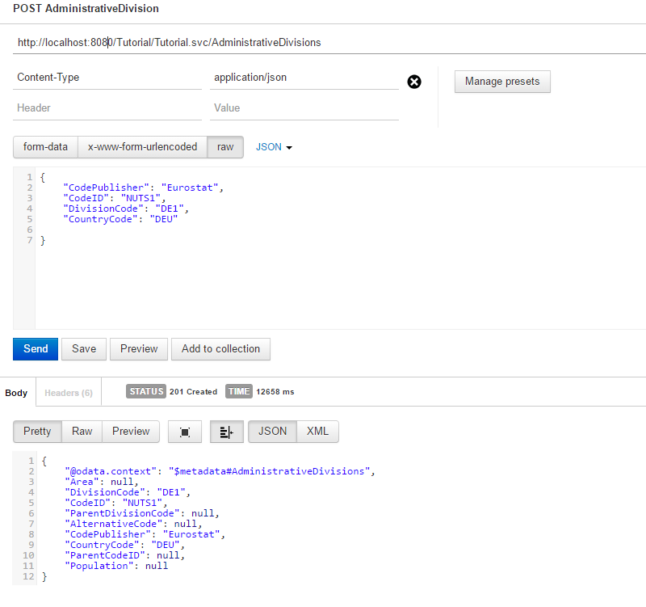

# 3.2 Creating Entities
As the first modifying request we want to have a closer look at is creating entities. In general OData describes three way to do this: As a single entity, which is discussed here, together with related entities, the so called [Deep Insert](3-5-DeepInsert.md) and via [Batch Requests](3-6-BatchRequests.md).

The `JPAODataCRUDHandler` was designed to take over repetitive work like preparing changes or creating a response depending on the request header. The business logic itself has to be implemented in a class that extends `JPAAbstractCUDRequestHandler`, we want to call it `CUDRequestHandler`, locate it in our new package _tutorial.modify_.

The processing of any modification is split into two methods. First a method to perform the change (including consistency checks) and second in a method (`validateChange`) that allow to validate the changes in the context with other modification, which is mainly required with [Batch Requests](3-6-BatchRequests.md).

Here we concentrate on performing changes and override `createEntity`. The method has two parameter.
1. _requestEntity_ is a container that provides access to data and information about a request. Form interest in this tutorial are:
	1. `getEntityType` provides an instance of _JPAEntityType_, which provides a bunch of information about the entity to be created. This starts with internal name of the JPA POJO and external name (name of OData entity) and ends with a list of attributes and keys.
	2. `getData` provides a map of attributes that are provided by the request. Keys of the map are the attribute names of the POJO. In case of complex/embedded attributes map is deep meaning the attribute is a map with the same structure.
	3. `getModifyUtil` provides an instance of `JPAModifyUtil`, which contains of some helper methods.
2. _em_ is an instance of `EntityManager`. A transaction has already been started, which is done to ensure the transactional integrity required for change sets within batch requests.

The method shall either returns an instance of the newly created POJO or a map like the one provided by `getData` including calculated fields.

Lets start creating a new AdministrativeDivision. As a first step we generate setter and getter methods. This can be done in Eclipse after opening `AdministrativeDivision.java` by choosing _Alt+Shift+S_ and then _Generate Getters and Setters..._ select all others then _children_ and _parent_. Please note that all attributes should be typed with wrapper classes instead of primitive types. Assoziations with multiplicity _ToMany_ shall always return an collection, so we change the getter for Children as follows:

```Java
public List<AdministrativeDivision> getChildren() {
	if (children == null)
		children = new ArrayList<AdministrativeDivision>();
	return children;
}
```


Having done that we can start with a simple implementation of our create method. We just take the values out of the map and put them into a new POJO instance:

```Java
package tutorial.modify;

import java.util.Map;

import javax.persistence.EntityManager;

import com.sap.olingo.jpa.metadata.core.edm.mapper.api.JPAEntityType;
import com.sap.olingo.jpa.processor.core.api.JPAAbstractCUDRequestHandler;
import com.sap.olingo.jpa.processor.core.exception.ODataJPAProcessException;
import com.sap.olingo.jpa.processor.core.processor.JPARequestEntity;

public class CUDRequestHandler extends JPAAbstractCUDRequestHandler {

	@Override
	public Object createEntity(final JPARequestEntity requestEntity, final EntityManager em)
			throws ODataJPAProcessException {

		final JPAEntityType et = requestEntity.getEntityType();

		if (et.getExternalName().equals("AdministrativeDivision")) {
			final Map<String, Object> jpaAttributes = requestEntity.getData();
			AdministrativeDivision result = new AdministrativeDivision();

			result.setCodeID((String) jpaAttributes.get("codeID"));
			result.setCodePublisher((String) jpaAttributes.get("codePublisher"));
			result.setDivisionCode((String) jpaAttributes.get("divisionCode"));

			result.setCountryCode((String) jpaAttributes.get("countryCode"));
			result.setParentCodeID((String) jpaAttributes.get("parentCodeID"));
			result.setParentDivisionCode((String) jpaAttributes.get("parentDivisionCode"));

			result.setAlternativeCode((String) jpaAttributes.get("alternativeCode"));
			result.setArea((Integer) jpaAttributes.get("area"));
			result.setPopulation((Long) jpaAttributes.get("population"));

			em.persist(result);
			return result;
		}
		return super.createEntity(requestEntity, em);
	}

}
```
As the last step before we can test our implementation, we have to make a small change at the Service implementation. Up to know we haven't provided the `JPAODataCRUDHandler` which is our handler implementation. So we have to add `handler.getJPAODataContext().setCUDRequestHandler(new CUDRequestHandler());`:

```Java
	...
			JPAODataCRUDHandler handler = new JPAODataCRUDHandler(PUNIT_NAME);
			handler.getJPAODataContext().setCUDRequestHandler(new CUDRequestHandler());
			handler.process(req, resp, em);
		} catch (RuntimeException e) {
	...
```

Now we are ready to check our implementation with our Rest client (e.g Postman). If we would use e.g. the following JSON

    {
        "CodePublisher": "Eurostat",
        "CodeID": "NUTS1",
        "DivisionCode": "DE1",
        "CountryCode": "DEU"
    }

and send a POST, we should get the following response:



Next you can try the following:

    {
        "CodePublisher": "Eurostat",
        "CodeID": "NUTS2",
        "DivisionCode": "DE11",
        "CountryCode": "DEU"
    }
We can retrieve the newly created entity via `.../Tutorial/Tutorial.svc/AdministrativeDivisions?$filter=DivisionCode eq 'DE1'`

If we want to play around with other entities we could go ahead the same approach as a above, so manually create an instance of the POJO and fill it step by step, which would get boring. We want to do some more generic stuff.

__Please note__ that we have used a simplified model for this tutorial where we map a database table field one to one to a property in our API. This is __not__ recommended, as this could make a table change to API change.

We want to create an instance base on the information of the entity type. The first step is to get the Constructors:

```Java
	private Constructor<?> getConstructor(final JPAStructuredType st) {
		Constructor<?> cons = null;
		Constructor<?>[] constructors = st.getTypeClass().getConstructors();
		for (int i = 0; i < constructors.length; i++) {
			cons = constructors[i];
			if (cons.getParameterCount() == 0) {
				break;
			}
		}
		return cons;
	}
```
Which we can use to create the POJO instance:
```Java
	private Object createInstance(final Constructor<?> cons) throws ODataJPAProcessorException {
		Object instance;
		try {
			instance = cons.newInstance();
		} catch (InstantiationException e) {
			throw new ODataJPAProcessorException(e, HttpStatusCode.INTERNAL_SERVER_ERROR);
		} catch (IllegalAccessException e) {
			throw new ODataJPAProcessorException(e, HttpStatusCode.INTERNAL_SERVER_ERROR);
		} catch (IllegalArgumentException e) {
			throw new ODataJPAProcessorException(e, HttpStatusCode.INTERNAL_SERVER_ERROR);
		} catch (InvocationTargetException e) {
			throw new ODataJPAProcessorException(e, HttpStatusCode.INTERNAL_SERVER_ERROR);
		}
		return instance;
	}
```
Using `JPAModifyUtil` we can replace the old implementation of `createEntity` with the following code:
```Java
	...
	final Object instance = createInstance(getConstructor(requestEntity.getEntityType()));
    requestEntity.getModifyUtil().setAttributesDeep(requestEntity.getData(), instance, requestEntity.getEntityType());
	em.persist(instance);
	return instance;
	...
```
Now lets generate the setter for Person and create a new one:

    {
        "ID" : "A34",
        "Country" : "CHE",
        "BirthDay": "1992-02-10",
        "LastName": "Müller",
        "FirstName": "Frida",
        "Address" : {
            "Country" : "DEU",
            "StreetName": "Test Starße",
            "CityName": "Berlin",
            "PostalCode": "10116",
            "HouseNumber": "23",
            "RegionCodePublisher": "ISO",
            "Region": "DE-BE",
            "RegionCodeID": "3166-2"
        },
        "AdministrativeInformation": {
            "Created": {
                "At": "2016-12-20T07:21:23Z",
                "By": "99"
            },
            "Updated": {
                "At": null,
                "By": ""
            }
        }
    }

Next we want to be able to make change to an existing entity: [Tutorial 3.3 Updating Entities](3-3-UpdatingEntities.md)