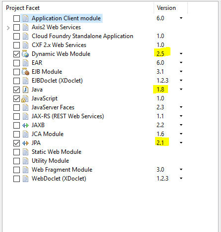
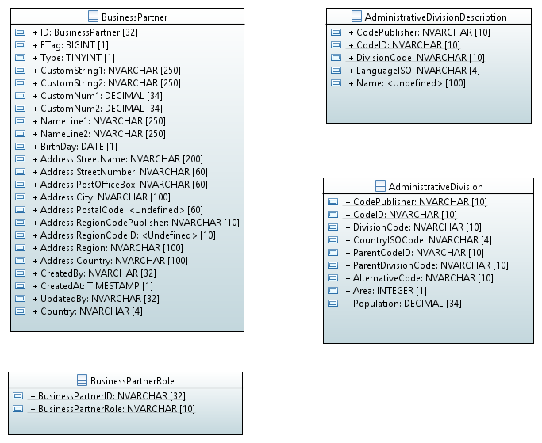

# Getting Started
The following series of tutorials shall give a starting point how to use the JPA-Processor to get a quick start in a Java project to utilize [Olingo](https://olingo.apache.org/doc/odata4/index.html) when [OData](http://www.odata.org/) shall be used. The tutorials use a simplified Business Partner data model.

## Prerequisites
In order to follow this tutorial, you should have
* Basic knowledge about OData and OData V4
* Knowledge of the Java programming language
* Basic knowledge about building with Maven
* Optional: knowledge about developing web applications

## Preparation
In order to perform the tutorial you need:
* A Java JDK 1.8 or higher
* A Eclipse IDE for Java EE, or another one that provides the same functionality
* A web server e.g. Apache Tomcat

## Create Project
First step is to create a project. To do so we want to create a new Maven project, by open the Maven Project wizard via File -> New -> Other -> Maven -> Maven Project. Select archetype **webapp**:


On the next page, enter the following information:
* Groupd Id: my.group.id
* Artifact Id: DemoJPAService
* Version: 4.0.0
* Package: myservice.mynamespace.service

Convert the project into a JPA project. This can be done as follows:

_Right click on the new project --> Configure --> Convert to JPA Project ..._

Now the project facets maintenance screen pops up. make sure that:
* Dynamic Web Module has at least version 2.5
* Java version is 1.6 or higher
* JPA as version 2.1



You can delete the index.jsp if it creates an error, we will not use it. Next step is to create the maven dependencies. For this tutorial we will use [HSBQL](http://hsqldb.org/) as database and [Eclipselink](http://www.eclipse.org/eclipselink/) as JPA implementation, but you can use also another database or JPA implementation that supports JPA 2.1. To create the data on the database we use Flyway. The following snippet shows the additionally required maven dependencies:
```XML
<dependency>
	<groupId>org.hsqldb</groupId>
	<artifactId>hsqldb</artifactId>
	<version>2.3.3</version>
</dependency>
<dependency>
	<groupId>org.flywaydb</groupId>
	<artifactId>flyway-core</artifactId>
	<version>4.0.3</version>
</dependency>
<dependency>
	<groupId>org.eclipse.persistence</groupId>
	<artifactId>javax.persistence</artifactId>
	<version>2.1.0</version>
</dependency>
<dependency>
	<groupId>javax.servlet</groupId>
	<artifactId>servlet-api</artifactId>
	<version>2.5</version>
	<scope>provided</scope>
</dependency>
<dependency>
	<groupId>org.eclipse.persistence</groupId>
	<artifactId>eclipselink</artifactId>
	<version>2.6.2</version>
</dependency>
<dependency>
	<groupId>com.sap.olingo</groupId>
	<artifactId>odata-jpa-processor</artifactId>
	<version>_current version_</version>
</dependency>
<build>
	<finalName>Tutorial</finalName>
	<pluginManagement>
		<plugins>
			<plugin>
				<groupId>org.apache.maven.plugins</groupId>
				<artifactId>maven-surefire-plugin</artifactId>
				<version>2.17</version>
			</plugin>
			<plugin>
				<groupId>org.apache.maven.plugins</groupId>
				<artifactId>maven-compiler-plugin</artifactId>
				<configuration>
					<source>${project.build.source}</source>
					<target>${project.build.source}</target>
					<showWarnings>true</showWarnings>
					<showDeprecation>true</showDeprecation>
					<compilerArgument>-Xlint:unchecked</compilerArgument>
					<encoding>${project.build.sourceEncoding}</encoding>
				</configuration>
			</plugin>
		</plugins>
	</pluginManagement>
</build>
<properties>
	<project.build.sourceEncoding>UTF-8</project.build.sourceEncoding>
	<project.build.source>1.8</project.build.source>
</properties>
```
Before we start we should have a look at the data model we want to create step-by-step throughout the tutorial. The data model describes, as mentioned, a simple business partner. The business partner has a name (fields NameLine1 and NameLine2), an address, information about who and when a business partner was created or changed and some fields that a user of the model can give his/her own semantic (CustomString1,CustomString2,CustomNum1,CustomNum2). A business partner can have multiple BusinessPartnerRoles. In addition there is some information about the region the business partner is located at. This information is stored in table AdministrativeDivision. Last, but not least there are textual description for the regions and countries.




Now we can start with the first series of tutorial about [using Metadata generation](../Metadata/1-0-Overview.md). Later you can learn in a second series of tutorial [how to retrieve data](../RetrieveData/2-0-Overview.md). Last, but not least, we will see how to [manipulate data](../ChangeData/3-0-Overview.md).
In addition there are documents handling some [special topics](../SpecialTopics/4-0-Overview.md).
