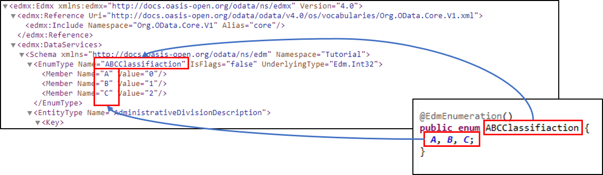
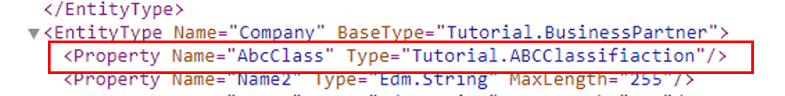
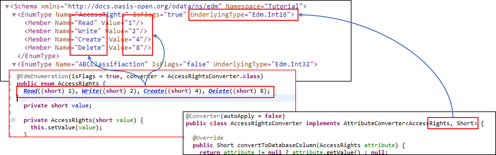

# 1.12 Enumeration Types

Since version 3 OData allows the specification of enumeration types. Together with Java enumerations it allows on the one hand to provide a client more details about the allowed values of a property and on the other hand to increase type safety in the code.

OData distinguish between two kinds of enumerations, the once members represent flags and the once the members are not flags. We want have a look at both and see how Java enumerations are used to create OData enumerations.

## Simple Enumerations

We want to assume that our Companies shall be classified using an ABC-Classification. For this an enumeration with the corresponding value shall be introduced:

```Java
package tutorial.model;

import com.sap.olingo.jpa.metadata.core.edm.annotation.EdmEnumeration;

@EdmEnumeration()
public enum ABCClassifiaction {
  A, B, C;
}
```
This enumeration is tagged with a `@EdmEnumeration` so it will be converted into an OData Enumeration, if it is found. As described in [Tutorial 1.8 Functions](1-8-Functions.md) it is neccesary to provide the package name to look for the enumerations. Therefore it is required to change our Servlet as follows:
```Java
...
handler.getJPAODataContext().setTypePackage("tutorial.operations", "tutorial.model");
...
```
With that we can already have a look at the metadata document, http://localhost:8080/Tutorial/Tutorial.svc/$metadata, which bases on the following mapping:



As you can see all not given values are filled with default value, which are _false_ for _isFlags_, and _Edm.Int32_, so _Integer_, as _UnderlingType_. The numbering of the members determined via the _ordinal()_ method of the enumeration.

Next we want to extend the company class with a property for the _ABC Class_. So we need to add a corresponding attribute to Company. Even so OData handles enumeration always as numeric values, the _ABC Class_ shall be stored as a String, which is signaled via JPA annotation` @Enumerated(value = EnumType.STRING)`. Please not that in case the property is used in an _orderby_ clause a client expect an order of a number, but would get a order of strings:

```Java
package tutorial.model;

import javax.persistence.Column;
import javax.persistence.DiscriminatorValue;
import javax.persistence.Entity;
import javax.persistence.EnumType;
import javax.persistence.Enumerated;

@Entity(name = "Company")
@DiscriminatorValue(value = "2")
public class Company extends BusinessPartner {

...

@Enumerated(value = EnumType.STRING)
@Column(name = "\"ABCClass\"")
private ABCClassifiaction abcClass;
```
If we have a look at the metadata again, we will find the following:


## Flag Based Enumeration

Here we take over the example given in [Schema Definition Language Documentation](http://docs.oasis-open.org/odata/odata/v4.0/errata03/os/complete/part3-csdl/odata-v4.0-errata03-os-part3-csdl-complete.html#_Toc453752565). Our use-case is that we want to be able to get insights into the access rights of a Person. The rights should be  _Read_, _Write_, _Create_ or _Delete_. A person may have multiple right at the same time thats why we need members, which are flags. The flags shall be encoded as short values:

```Java
package tutorial.model;

import com.sap.olingo.jpa.metadata.core.edm.annotation.EdmEnumeration;

@EdmEnumeration(isFlags = true, converter = AccessRightsConverter.class)
public enum AccessRights {
  Read((short) 1), Write((short) 2), Create((short) 4), Delete((short) 8);

  private short value;

  private AccessRights(short value) {
    this.setValue(value);
  }

  public short getValue() {
    return value;
  }

  private void setValue(short value) {
    this.value = value;
  }
}
```
The EdmEnumeration annotation has been enriched, so the JPA processor knows that the members are flags and that the value shall not be determined via `ordinal()` but via a converter, which we can later use, when we add a column to the Person. The converter converts from respectively into an array of enumeration instances. This is neccesary, as here more than one member may be selected at a time. A simple converter can look as follows:
```Java
package tutorial.model;

import java.util.ArrayList;
import java.util.List;

import javax.persistence.AttributeConverter;
import javax.persistence.Converter;

@Converter(autoApply = false)
public class AccessRightsConverter implements AttributeConverter<AccessRights[], Short> {

  @Override
  public Short convertToDatabaseColumn(AccessRights[] attributes) {
    if (attributes == null)
      return null;
    short value = 0;
    for (AccessRights attribute : attributes)
      if (attribute != null)
        value += attribute.getValue();
    return value;
  }

  @Override
  public AccessRights[] convertToEntityAttribute(Short dbData) {
    if (dbData == null)
      return null;
    List<AccessRights> members = new ArrayList<AccessRights>(4);
    if ((dbData & AccessRights.Read.getValue()) > 0)
      members.add(AccessRights.Read);
    if ((dbData & AccessRights.Create.getValue()) > 0)
      members.add(AccessRights.Create);
    if ((dbData & AccessRights.Write.getValue()) > 0)
      members.add(AccessRights.Write);
    if ((dbData & AccessRights.Delete.getValue()) > 0)
      members.add(AccessRights.Delete);
    return members.toArray(new AccessRights[] {});
  }

}
```
Again we can have a look at the metadata document and find the following mapping:



Now, as the last step, let's create the access rights column:

```Java
package tutorial.model;

import java.sql.Date;

import javax.persistence.Column;
import javax.persistence.Convert;
import javax.persistence.DiscriminatorValue;
import javax.persistence.Entity;

@Entity(name = "Person")
@DiscriminatorValue(value = "1")
public class Person extends BusinessPartner {
...
@Convert(converter = AccessRightsConverter.class)
@Column(name = "\"AccessRights\"")
private AccessRights[] accessRights;
...
```
