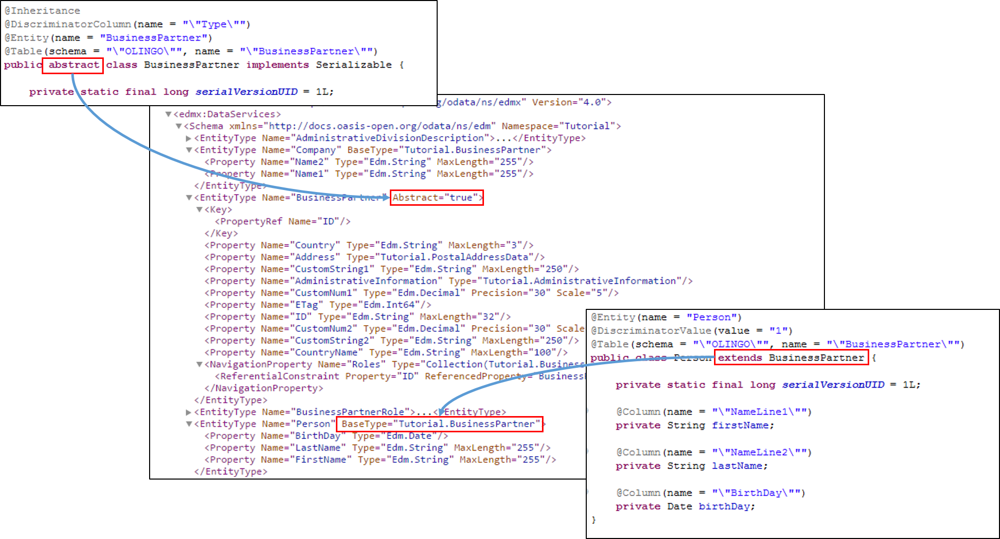

# 1.4: Subtypes
Currently we have one entity representing all our business partner, but indeed they are either companies or persons. We want to be able to distinguish between both, 
even so we still use only one database table. As the first step we create two new classes:  
First the Person:    
```Java
package tutorial.model;

import java.sql.Date;

import javax.persistence.Column;
import javax.persistence.DiscriminatorValue;
import javax.persistence.Entity;
import javax.persistence.Table;

@Entity(name = "Person")
@DiscriminatorValue(value = "1")
@Table(schema = "\"OLINGO\"", name = "\"BusinessPartner\"")
public class Person extends BusinessPartner {

	private static final long serialVersionUID = 1L;

	@Column(name = "\"NameLine1\"")
	private String firstName;

	@Column(name = "\"NameLine2\"")
	private String lastName;

	@Column(name = "\"BirthDay\"")
	private Date birthDay;
}
```

Second the Company
```Java
package tutorial.model;

import javax.persistence.Column;
import javax.persistence.DiscriminatorValue;
import javax.persistence.Entity;
import javax.persistence.Table;

@Entity(name = "Company")
@DiscriminatorValue(value = "2")
@Table(schema = "\"OLINGO\"", name = "\"BusinessPartner\"")
public class Company extends BusinessPartner {

	private static final long serialVersionUID = 1L;

	@Column(name = "\"NameLine1\"")
	private String name1;

	@Column(name = "\"NameLine2\"")
	private String name2;
}
```
In the example a person shall have a birth day and different property names than a company. So the attributes are in both classes.
In addition we want ensure that no one retrieves business partner. To achieve this we make the Business Partner abstract:
 
```Java
@Inheritance
@DiscriminatorColumn(name = "\"Type\"")
@Entity(name = "BusinessPartner")
@Table(schema = "\"OLINGO\"", name = "\"BusinessPartner\"")
public abstract class BusinessPartner implements Serializable {

	private static final long serialVersionUID = 1L;
	...
```
Like before we have to add the new entities to the persistence.xml and can have a look at the result _http://localhost:8080/Tutorial/Tutorial.svc/$metadata_.
   

Next step: [Tutorial 1.5: Use Complex Types](1-5-UsingComplexTypes.md)