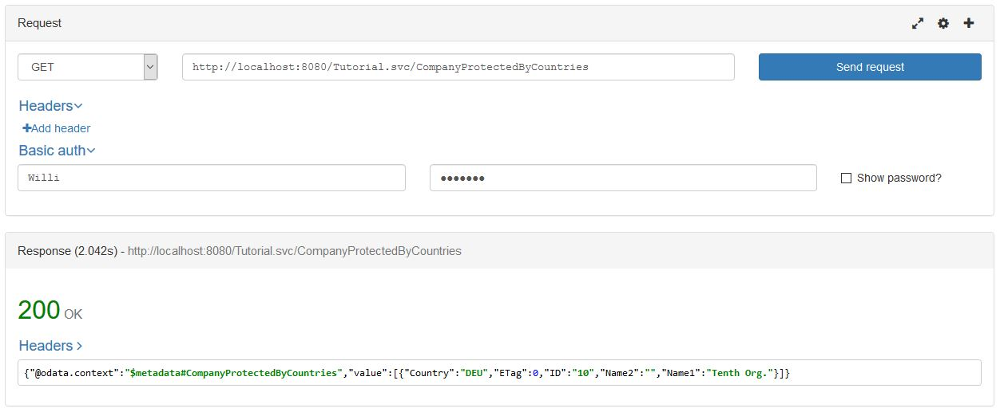

# 4.4 Instance Based Authorizations

To protect services usually two level of authorizations are used. First level describes if a user is allowed to access a certain entity type or entity set using a certain http verb, also known as scopes. The second level describes, in case a user is allowed to access an entity type, which instances he/she may get or modify, so called instance restrictions. Whereas the first one has to be done outside the JPA Processor e.g. using Spring Security,  we want see how the second one can be implemented e.g. to push down the instance restrictions for GET request down to the database.

## User management in the same service

The instance restrictions grant access to a set of entities. This is done by providing so called [JPAClaimsPair](../../../jpa/odata-jpa-processor/src/main/java/com/sap/olingo/jpa/processor/core/api/JPAClaimsPair.java). One pair contains of a range providing the upper and lower limit of an attribute that is used to grant access to an entity. These pairs are collected by an instance of [JPAODataClaimsProvider](com/sap/olingo/jpa/processor/core/api/JPAODataClaimsProvider.java).

For this part, we want to assume that the service we implement also contains the information about user and their restrictions. As a consequence the only claim we have is the id of the user, which we will get from the Authentication header.

### Examples 1: Restrict access to company by country

We want to grant access to Companies based on their location or in other words user are responsible for Companies from one or multiple countries and should only access those. 

First we need to create a table to store the user. Beside User Name and Password (not important for the tutorial) we want to be able to assign a user to a User Group and to enable/disable user. The following SQL snippet, which need to be added to the [migration document](../RetrieveData/migration/V1_0__olingo.sql), shows the creation of the User table and the creation of three user:

```SQL
CREATE TABLE "User" (
    "UserName"  VARCHAR(60) NOT NULL ,
    "Password" VARCHAR(60),
    "Group" VARCHAR(5),
    "Enabled" BOOLEAN,
    PRIMARY KEY ("UserName"));
INSERT INTO "User" VALUES ('Willi', 'bN985noWuJcdilbg6', 'EMP', true);
INSERT INTO "User" VALUES ('Marvin', 'kFo1nr6hG3EBRx4Gp', 'ADM', true);
INSERT INTO "User" VALUES ('Lisa', 'EbOy0vYtpWkE78KWE', 'EMP', true);
```

Having done that, we can create another table. This table assigns countries to user.
Countries a company is located in and so a user is allowed to access them.

```SQL
CREATE TABLE "CountryRestriction" (
    "UserName"  VARCHAR(60) NOT NULL ,
    "SequenceNumber" INTEGER NOT NULL,
    "From"  VARCHAR(4) NOT NULL ,
    "To"  VARCHAR(4),
    PRIMARY KEY ("UserName","SequenceNumber"));
INSERT INTO "CountryRestriction" VALUES ('Willi', 1, 'DEU', 'DEU');
INSERT INTO "CountryRestriction" VALUES ('Marvin', 1, 'CHE', 'ZAF')
```

As a last step. We create a view that combines the business partner and the restriction table:

```SQL
CREATE VIEW "CompanyProtectedByCountry" AS
    SELECT
        b."ID",
        b."ETag",
        b."NameLine1",
        b."NameLine2",
        b."Country",
        r. "UserName"
    FROM "BusinessPartner" as b
    INNER JOIN "CountryRestriction" as r
        ON b."Country" >= r."From"
        AND b."Country" <= r."To"
  INNER JOIN "User" as u
    ON r."UserName" = u."UserName"
    AND u."Enabled" = true
    WHERE b."Type" = '2';
```

The projection of our view now contains a column for the user name. This column will be used to restrict the selected companies. 

On the Java side we need to create a new JPA entity. This entity contains as special property `username`. The property is annotated with  `@EdmIgnore`, because we done want to expose `username` and `@EdmProtectedBy(name = "UserId")`. The later one marks the property as	authorization relevant and gives the name of the attribute that will be used for filtering.

```Java
package tutorial.model;

import java.util.Collection;

import javax.persistence.CascadeType;
import javax.persistence.Column;
import javax.persistence.Entity;
import javax.persistence.FetchType;
import javax.persistence.Id;
import javax.persistence.JoinColumn;
import javax.persistence.OneToMany;
import javax.persistence.Table;
import javax.persistence.Version;

import com.sap.olingo.jpa.metadata.core.edm.annotation.EdmIgnore;
import com.sap.olingo.jpa.metadata.core.edm.annotation.EdmProtectedBy;

@Entity
@Table(schema = "\"OLINGO\"", name = "\"CompanyProtectedByCountry\"")
public class CompanyProtectedByCountry {

  @Id
  @Column(name = "\"ID\"")
  protected String iD;

  @Version
  @Column(name = "\"ETag\"", nullable = false)
  protected long eTag;

  @Column(name = "\"NameLine1\"")
  private String name1;

  @Column(name = "\"NameLine2\"")
  private String name2;

  @Column(name = "\"Country\"", length = 4)
  private String country;

  @EdmProtectedBy(name = "UserId")
  @EdmIgnore
  @Column(name = "\"UserName\"", length = 60)
  private String username;

  @OneToMany(fetch = FetchType.LAZY, cascade = CascadeType.REMOVE)
  @JoinColumn(name = "\"BusinessPartnerID\"", referencedColumnName = "\"ID\"", insertable = false, updatable = false)
  private Collection<BusinessPartnerRole> roles;
}
```

Now we can go to our servlet and create the claims. For the tutorial we want to keep things simple and force a user to always send basic authentication. The next method will extract the User from the authentication header and provides it as a claim:

```Java
  private JPAODataClaimsProvider createClaims(final HttpServletRequest req) {
    final String auth = req.getHeader("Authorization");
    final JPAODataClaimsProvider claims = new JPAODataClaimsProvider();
    if (auth != null && !auth.isEmpty()) {
      final String[] authDetails = auth.split(" ");
      if (authDetails.length == 2 && authDetails[0].equals("Basic")) {
        final String[] baseAuth = new String(Base64.getDecoder().decode(authDetails[1]), StandardCharsets.UTF_8)
            .split(":");
        final JPAClaimsPair<String> user = new JPAClaimsPair<>(baseAuth[0]);
        claims.add("UserId", user);
      }
    }
    return claims;
  }
```

Last but not least, the claims have to be forwarded to the JPA processor:

```Java
      handler.getJPAODataRequestContext().setClaimsProvider(createClaims(req));
      handler.process(req, resp);
```

No we can run some queries. As we need to set the Authentication header, we need to use a rest client:

  

Feel free to use another user or to play around with the database entries. You can also have a look what happens with
`.../CompanyProtectedByCountries?$expand=Roles` or `.../Roles`. You will notice that `.../Roles` is not protected. In cases like this a user can see ids of Companies the user is not allowed to see. Depending on the use case this may be a problem. Various solutions exists for this. Here some of them:

1. Create a unique Id for Roles and hide the company id.
1. Protect Roles as well.
1. Convert Roles into a collection attribute.

### Examples 2: Restrict access to company by role

We want have a look at a second scenario. Instead of restricting the access to companies by their location. We want to restrict the access by the role a company has. But this is not the only thing. We also want to prevent that user of a certain Group, here ADM, see the name of a company. 

We start with the creation of a table that carries the restrictions. The table has the same structure as the one before:

```SQL
CREATE TABLE "RoleRestriction" (
    "UserName"  VARCHAR(60) NOT NULL ,
    "SequenceNumber" INTEGER NOT NULL,
    "From"  VARCHAR(4) NOT NULL ,
    "To"  VARCHAR(4),
    PRIMARY KEY ("UserName","SequenceNumber"));

INSERT INTO "RoleRestriction" VALUES ('Marvin', 1, 'C', 'C');
INSERT INTO "RoleRestriction" VALUES ('Lisa', 1, 'A', 'A');
INSERT INTO "RoleRestriction" VALUES ('Lisa', 2, 'B', 'B');
```

So lets have a look at the view we need:

```SQL
CREATE VIEW "CompanyProtectedByRole" AS
    SELECT DISTINCT
        b."ID",
        b."ETag",
        b."Country",
        CASE u."Group"
            WHEN 'ADM' THEN null
            ELSE b."NameLine1"
        END as "NameLine1",
        CASE u."Group"
            WHEN 'ADM' THEN null
            ELSE b."NameLine2"
        END as "NameLine2",
        r. "UserName"
    FROM "BusinessPartner" as b
    INNER JOIN "BusinessPartnerRole" as role
        on role."BusinessPartnerID" =  b."ID"
    INNER JOIN "RoleRestriction" as r
        ON  role."BusinessPartnerRole" >= r."From"
        AND  role."BusinessPartnerRole" <= r."To"
    INNER JOIN 	"User" as u
        on r."UserName" = u."UserName"
    AND u."Enabled" = true
    WHERE b."Type" = '2';
```

Beside the join condition the view also contains also of a `CASE` statement within the projection, which restricts a values a user of Group ADM.

```Java
package tutorial.model;

import java.util.Collection;

import javax.persistence.CascadeType;
import javax.persistence.Column;
import javax.persistence.Entity;
import javax.persistence.FetchType;
import javax.persistence.Id;
import javax.persistence.JoinColumn;
import javax.persistence.OneToMany;
import javax.persistence.Table;
import javax.persistence.Version;

import com.sap.olingo.jpa.metadata.core.edm.annotation.EdmIgnore;
import com.sap.olingo.jpa.metadata.core.edm.annotation.EdmProtectedBy;

@Entity
@Table(schema = "\"OLINGO\"", name = "\"CompanyProtectedByRole\"")
public class CompanyProtectedByRole {

  @Id
  @Column(name = "\"ID\"")
  protected String iD;

  @Version
  @Column(name = "\"ETag\"", nullable = false)
  protected long eTag;

  @Column(name = "\"NameLine1\"")
  private String name1;

  @Column(name = "\"NameLine2\"")
  private String name2;

  @Column(name = "\"Country\"", length = 4)
  private String country;

  @EdmProtectedBy(name = "UserId")
  @EdmIgnore
  @Column(name = "\"UserName\"", length = 60)
  private String username;

  @OneToMany(fetch = FetchType.LAZY, cascade = CascadeType.REMOVE)
  @JoinColumn(name = "\"BusinessPartnerID\"", referencedColumnName = "\"ID\"", insertable = false, updatable = false)
  private Collection<BusinessPartnerRole> roles;
}
```

## Important note

The mentioned mechanism creating a join allows a quick and easy introduction of instance restrictions, but comes with a draw back. The join introduces a new field/property without (business) relevance. This can lead at `$filter` requests to unwanted results. Lets have a look at a small example:<br>
Lets assume that not all user shall see all the Roles of a Company, so we create a join for roles as well:

```SQL
CREATE TABLE "RoleRestriction" (
    "UserName"  VARCHAR(60) NOT NULL ,
    "SequenceNumber" INTEGER NOT NULL,
    "From"  VARCHAR(10) NOT NULL ,
    "To"  VARCHAR(10),
    PRIMARY KEY ("UserName","SequenceNumber"));
INSERT INTO "RoleRestriction" VALUES ('Marvin', 1, 'A', 'B');
INSERT INTO "RoleRestriction" VALUES ('Willi', 1, 'A', 'A');
INSERT INTO "RoleRestriction" VALUES ('Willi', 2, 'C', 'C');

CREATE VIEW "RoleProtected" AS
    SELECT
        role."BusinessPartnerID",
        role."BusinessPartnerRole",
        r."UserName"
    FROM "BusinessPartnerRole" AS role
    INNER JOIN "RoleRestriction" AS r
        ON role."BusinessPartnerRole" >= r."From"
        AND role."BusinessPartnerRole" <= r."To";
```

and the corresponding JPA POJO with the entity name `BusinessPartnerRoleProtected` and the relation between `CompanyProtectedByCountry`, which we want to call `RolesProtected`. With that we would be able to create requests like: `CompanyProtectedByCountry?$select=ID&$filter=RolesProtected/$count ge 2`. In case, for some reasons, it is decided that instead of restricting access by the User Name the user shall have access to all companies and all roles the query will return 3 instead of two results. Even so it is possible to prevent this with SQL:

```SQL
SELECT DISTINCT t0."ID"
    FROM "OLINGO"."BusinessPartnerProtected" t0
    WHERE (EXISTS (
        SELECT t1."BusinessPartnerID"
            FROM (SELECT DISTINCT t2."BusinessPartnerID", t2."BusinessPartnerRole"
                    FROM "OLINGO"."RoleProtected" t2
                    WHERE (t2."UserName" LIKE '%')) t1
        WHERE (t1."BusinessPartnerID" = t0."ID")
        GROUP BY t1."BusinessPartnerID"
        HAVING (COUNT(t1."BusinessPartnerID") >= 2))  
    AND (t0."UserName" LIKE '%'));
```

no way of creating this using JPQL is known. Two options to prevent this are known:

1. In case User Name (or User Id) for joining, do not support wild cards
1. Spend an additional database round trip and read the claims before calling the jpa processor and feed the claims provider with the read values.

## Additional Remarks

If user and authorities are not handled by the service itself, but e.g. via a JWT, all relevant properties have to be forwarded via `JPAODataClaimsProvider`.

For modifying requests the Claims can be retrieved from a provided instance of [JPARequestEntity](../../../jpa/odata-jpa-processor/src/main/java/com/sap/olingo/jpa/processor/core/processor/JPARequestEntity.java) via method `getClaims`

Annotating collection attributes is not supported.
